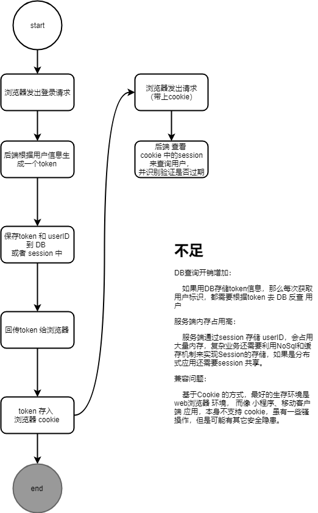
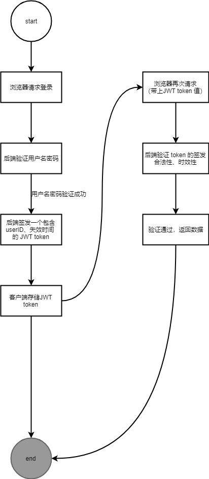

## 环境
* hapi 采用v16版本
* dependencies
    ```
    npm i --save hapi@16
    npm i --save env2
    npm i --save hapi-swagger@7
    npm i --save inert@4
    npm i --save vision@4
    npm i --save package
    npm i --save joi@13
    npm i --save sequelize
    npm i --save vision
    npm i --save mysql2
    npm i --save hapi-pagination@1
    ```
* dev-dependencies
    ```
    npm i --save-dev nodemon
    ```

## 使用Sequelize 操作DB 和 table 的创建
注意问题：
当安装的mysql 版本大于4，可能会出现`ERROR: Client does not support authentication protocol requested by server; consider upgrading MySQL client`
的错误，那是因为 mysql 的密码加解密算法在高版本更改了，而其 Mysql client 又没跟上节奏，所以会导致我们外部应用进行DB操作时无法访问。
解决方法：
去`mysql installer`中的`Authentication Method`过程那里重新设置解密方式为第二种（沿用旧版本的密码加密方式）.
> 参考文章：http://tieba.baidu.com/p/5658058140?traceid=


## 传统Token验证 VS JWT
* 传统验证:
  
* jwt:
  
  * 特点：
    * json web token，基于RFC 7519 定义。
    * 【减少网络传输】紧凑（compact）：因为 JWT自身体积小，可通过HTTP 请求的header 来传递 （身份验证时一般放在 `Authorization` 字段中）。
    * 【减少DB查询次数】自包含（self-contained）：JWT的payload中能够包含系统所需的非敏感性关键业务数据，如：userID
  * 优点：
    * 跨语言：payload 数据结构基于json，可被任何主流语言支持。
    * 免疫 CSRF： 对Cookie 的不依赖性，使其 天然免疫 CSRF攻击。
    * 跨域： 对Cookie 的不依赖性，决定了更好的跨域支持和独立服务化属性。
    * 多端适配：iOS，Android，小程序等费网页客户端，Cookie 不被支持，但是JWT的验证机制则可以。
    * 去耦可扩展性：JWT可在任何拥有正确 secret 私钥 的 API 服务环境被身份验证和使用，便于微服务拆分。
  * 使用注意事项：
    * 不要在JWT的payload 中签入敏感信息
    * 保护好secret 私钥
    * 使用https 传输JWT
    * 设置较短的JWT失效时间，并结合一个失效较长的JWT RefreshToken 组合 为宜。（因为JWT 无法轻易失效已签发的合法JWT）。

